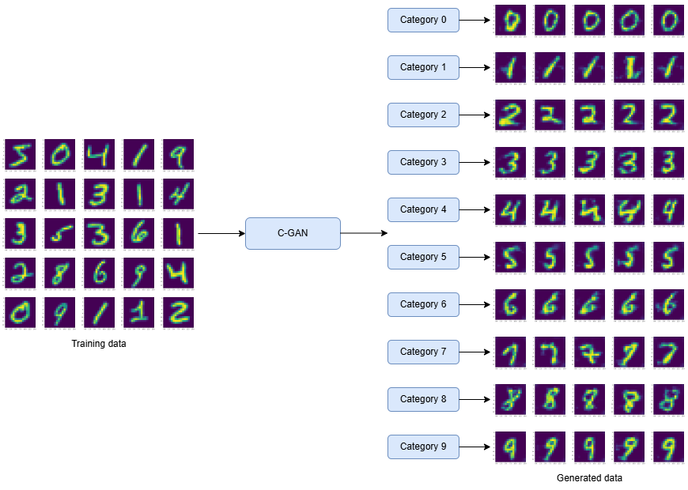

# Conditional Generative Adversarial Network (C-GAN) for image generation on MNIST dataset
Implementation of c-GAN model for image generation on MNIST dataset. Synthetic image generation of handwritten numbers as per their class using c-GAN model. 

## Input Dataset
MNIST dataset is the input dataset for the generative model. Dataset of size 60,000 samples with their labels have been used for training.

## Prerequisites
- Docker
If running without Docker, required python libraries:
- torch
- numpy
- matplotlib
- torchvision

## Running the Model
For training the model and image generation, 
```
# 1. Clone the repo
git clone https://github.com/Amal-Jyothis/mnist_cgan
cd mnist-gan

# 2. Run with docker
docker build -t mnist-cgan .
docker run -p 3000:3000 -v folder-path-for-outputs:/app/output mnist-cgan
```
```folder-path-for-ouputs``` is the path of the folder where generated images needs to be stored.

## Results
Generated images are stored in ```folder-path-for-ouputs``` with each class in the folder named as per their labels. Generation of numbers' images,<br/>




